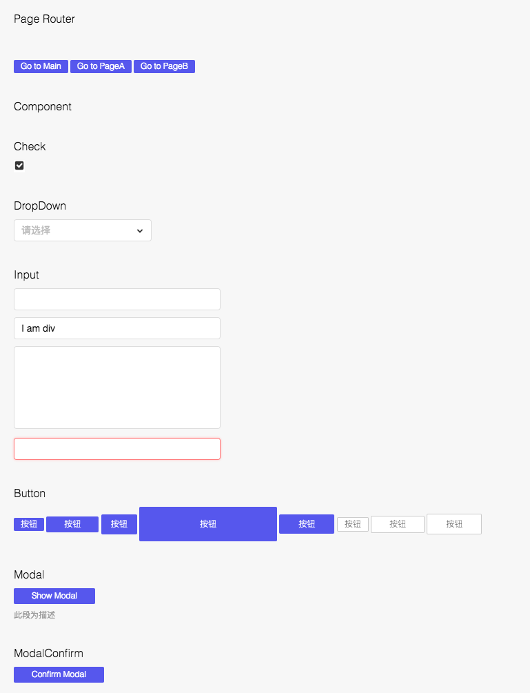
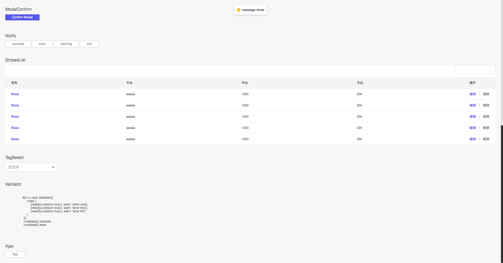

# 前端项目

### 适用范围
适用于后台管理系统,或者整个系统不刷新,单页面应用的富应用。
嵌套页面应用,类似于iframe传统后台,省去刷新加载。

### 目录说明
> public 静态资源根目录

> res 字体文件等存放目录

> scripts webpack打包配置文件目录

> src 开发源代码

>> js 代码
>> mcss 样式代码
>> module 页面代码

> WEB-INF/template 页面入口模板

`src` 为开发目录, index.js 为入口,routes.js为所有路由配置。

### 开发建议
* 开发过程中,可以使用全局注入的变量Regular,RGUI,Service,Component。
* Service请求接口为`src/js/service/index.js`,可以再建立文件夹进行页面接口分类,再由index.js集中对外开放使用。比如:

```javascript
Service.Index.getTitleData().then((res)=>{}); // Index 页面
Service.Main.getTableData().then((res)=>{}); // Main 页面
Service.Main.getFormData().then((res)=>{}); // Main 页面
```
* 所有的公用组件放在`src/js/components/`,通过`index.js`导出挂在全局Component变量供页面使用,比如: new Component.Modal();
如果开发新组件,请在index.js中陆续添加进去。组件样式请写在`src/mcss/components`下,由main.mcss统一打包导出。
* `src/js/util`下可以放置一些工具处理,比如静态枚举类型,dom操作,Regular过滤器,Regular标签扩展属性,存储等。
* 开发需要完善组件文档[COMPONENT.md](COMPONENT.md)
* 详细样式文档请查阅`src/mcss/README.md`[文档](src/mcss/README.md)

### 启动使用

#### 1. 安装依赖包
首先,确保你安装了nodejs 和 npm.
```shell
cnpm install
```

#### 2. 安装nei
```shell
cnpm install -g nei
```

#### 3. 安装nei项目环境(key需要自己生成)[在NEI网站自己项目中](https://nei.netease.com/)
安装nei项目环境`前端webapp根目录下`
```shell
nei build -k 20252ab9ec26384420baea8e9300d8b1
```
更新mock数据接口`前端webapp根目录下`
```shell
nei update
```

#### 4. 本地运行环境
```shell
gulp
```

#### 5. 打包上线
```shell
gulp build
```

#### 6. 调试接口
```shell
gulp interface
```

### 预览




### 参考文档

1. nei [mock数据配置](https://nei.netease.com)
2. [Regularjs](http://regularjs.github.io/guide/zh/intro/README.html)
3. [RegularUI](https://regular-ui.github.io/start/quickstart.html)
4. [Mcss语法](https://github.com/leeluolee/mcss)
5. [Mass语法](https://github.com/leeluolee/mass)
6. [Mass css3语法](https://github.com/leeluolee/mass/blob/master/mass/css3.mcss)
7. [stateman 路由继承组件](http://leeluolee.github.io/stateman/?API-zh#stateman-api-reference-about-routing-routing-params)
8. [路由参数获取例子](https://github.com/regularjs/example/blob/master/spa/app/script/module/blog.edit.js)
9. [regular-state](http://regularjs.github.io/regular-state/docs/core/option.html)


